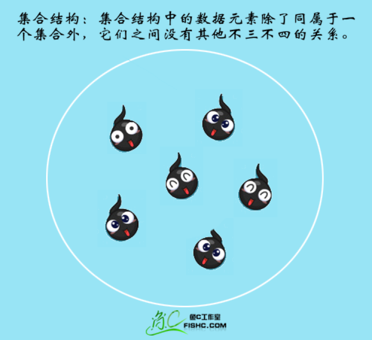
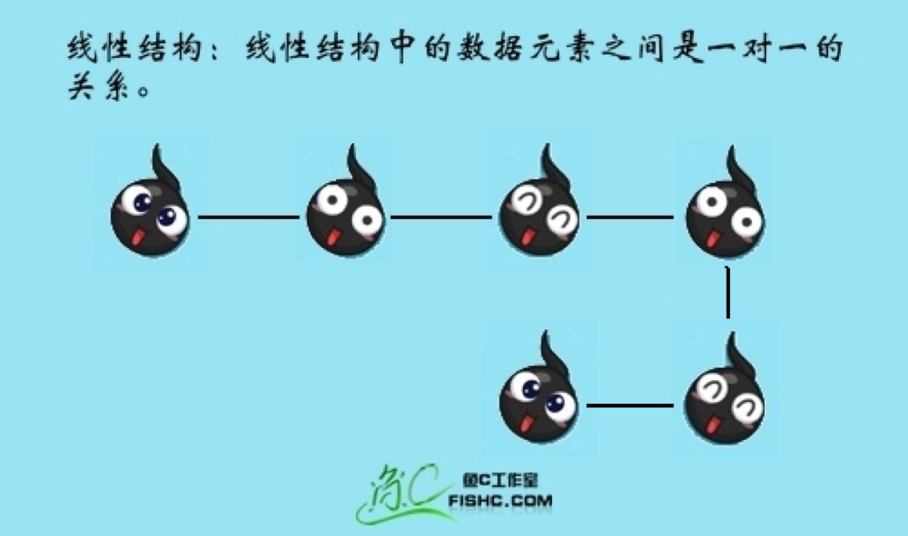
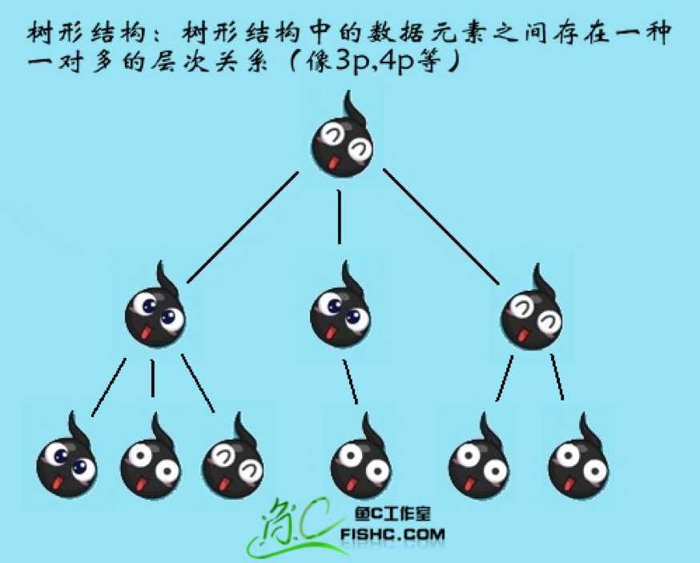
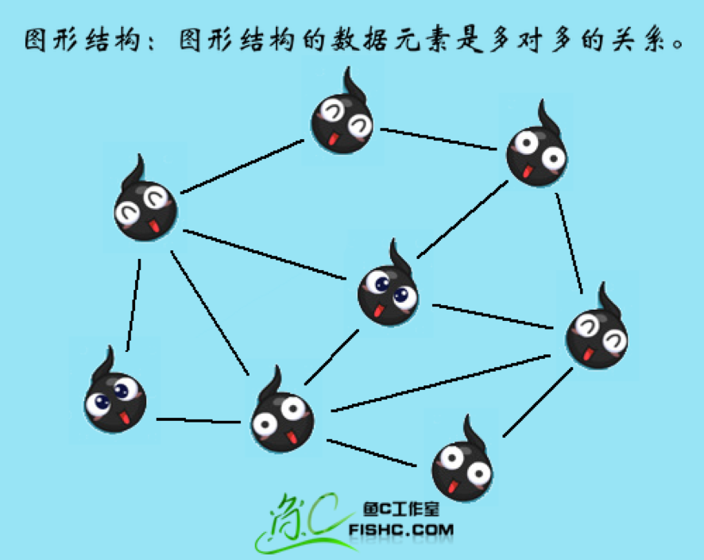

# 01-introduction

## 第一讲 数据结构和算法绪论
[返回主目录](../README.md)

### 1.什么是数据结构？
程序设计 = 数据结构 + 算法

再简单的来说数据结构就是关系，没错，就是数据元素相互之间存在的一种或多种特定关系的集合。

逻辑结构和物理结构

### 2 逻辑结构
#### 2.1 集合结构

#### 2.2 线性结构（1对1）

#### 2.3 树形结构（1对多）

#### 2.4 图形结构（多对多）

### 3 物理结构
顺序存储结构：是把数据元素存放在地址连续的存储单元里，其数据间的逻辑关系和物理关系是一致的。

链式存储结构：是把数据元素存放在任意的存储单元里，这组存储单元可以是连续的，也可以是不连续的。

