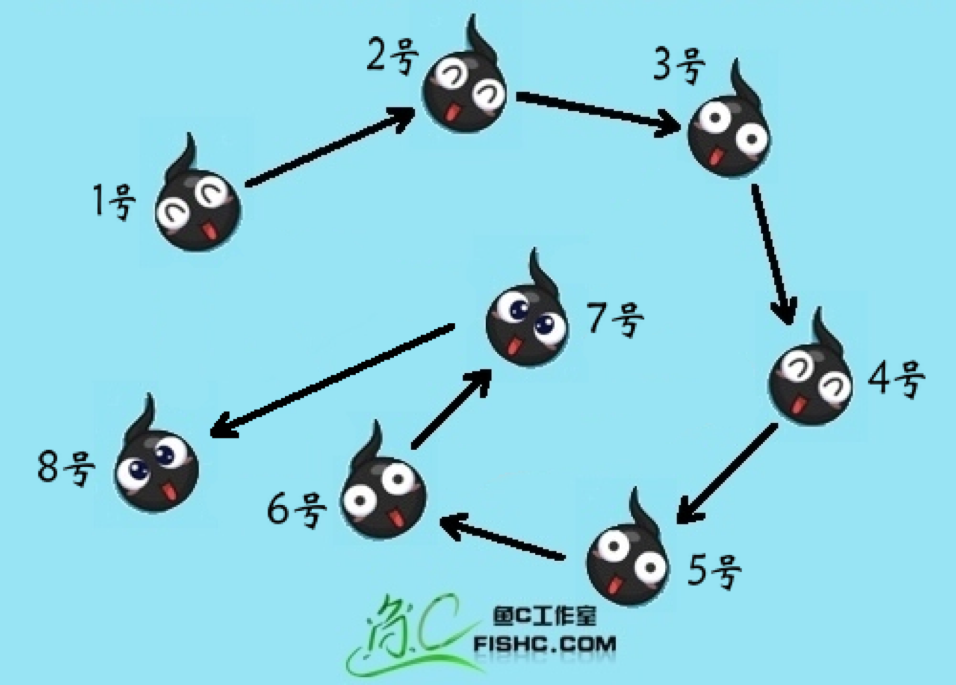

# 01-introduction

## 第一讲 数据结构和算法绪论
[返回主目录](../README.md)

### 1.什么是数据结构？
程序设计 = 数据结构 + 算法

再简单的来说数据结构就是关系，没错，就是数据元素相互之间存在的一种或多种特定关系的集合。

逻辑结构和物理结构

### 2 逻辑结构
#### 2.1 集合结构（Collection）

#### 2.2 线性结构（Linear、1对1）

#### 2.3 树形结构（Tree、1对多）

#### 2.4 图形结构（Graph、多对多）


### 3 物理结构
顺序存储结构：是把数据元素存放在地址连续的存储单元里，其数据间的逻辑关系和物理关系是一致的。

链式存储结构：是把数据元素存放在任意的存储单元里，这组存储单元可以是连续的，也可以是不连续的。


### 4 算法
算法设计的要求：时间效率高和存储量低

### 4.1 算法效率的度量方法
```java
第一种算法：
int i, sum = 0, n = 100;   // 执行1次
for( i=1; i <= n; i++ )    // 执行了n+1次
{
sum = sum + i;          // 执行n次
}

第二种算法：
int sum = 0, n = 100;     // 执行1次
sum = (1+n)*n/2;          // 执行1次

第一种算法执行了1+(n+1)+n=2n+2次。
第二种算法，是1+1=2次


```
判断一个算法的效率时，函数中的常数和其他次要项常常可以忽略，而更应该关注主项（最高项）的阶数。
所以：
第一种算法：O(n)
第二种算法：O(1)

### 5 算法的时间复杂度
执行次数==时间

#### 5.1 推导大O阶方法
    用常数1取代运行时间中的所有加法常数。
    在修改后的运行次数函数中，只保留最高阶项。
    如果最高阶项存在且不是1，则去除与这个项相乘的常数。
    得到的最后结果就是大O阶。

### 5.2 大O阶种类
    常数阶：O(1)
    线性阶：O(n)
    平方阶：O(n^2)
    对数阶：O(logn)
对数阶有必要解释下：
```java
int i = 1, n = 100;
while( i < n )
{
i = i * 2;
}

由于每次i*2之后，就举例n更近一步，假设有x个2相乘后大于或等于n，则会退出循环。
于是由2^x = n得到x = log(2)n，所以这个循环的时间复杂度为O(logn)。

```
    nlogn阶：O(nlogn)
    立方阶：O(n^3)
    指数阶：O(2^n)

### 5.3 常用的时间复杂度所耗费的时间
从小到大依次是：O(1) < O(logn) < O(n) < O(nlogn) < O(n^2) < O(n^3) < O(2^n) < O(n!) < O(n^n)

### 6 算法的空间复杂度

我们在写代码时，完全可以用空间来换取时间。

举个例子说，要判断某年是不是闰年，你可能会花一点心思来写一个算法，每给一个年份，就可以通过这个算法计算得到是否闰年的结果。

另外一种方法是，事先建立一个有2050个元素的数组，然后把所有的年份按下标的数字对应，如果是闰年，则此数组元素的值是1，如果不是元素的值则为0。这样，所谓的判断某一年是否为闰年就变成了查找这个数组某一个元素的值的问题。

第一种方法相比起第二种来说很明显非常节省空间，但每一次查询都需要经过一系列的计算才能知道是否为闰年。第二种方法虽然需要在内存里存储2050个元素的数组，但是每次查询只需要一次索引判断即可。

附思维导图：


