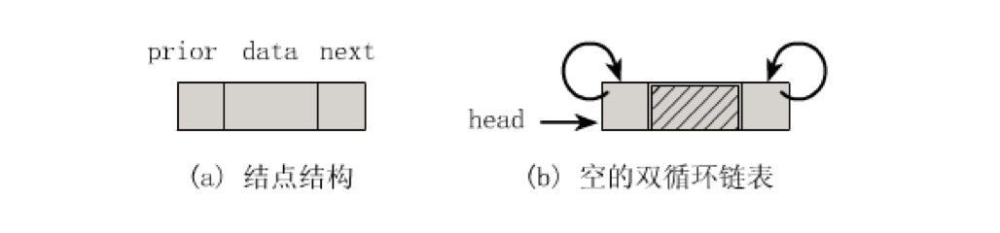
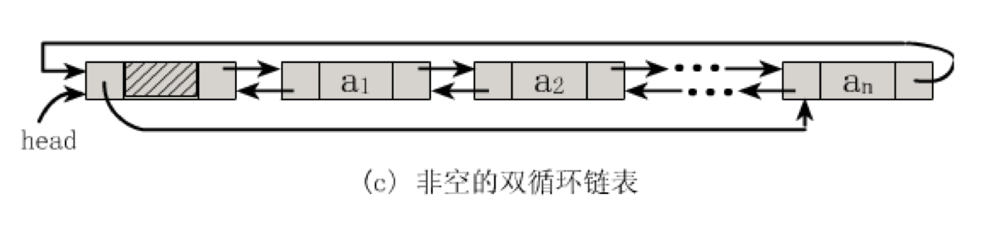
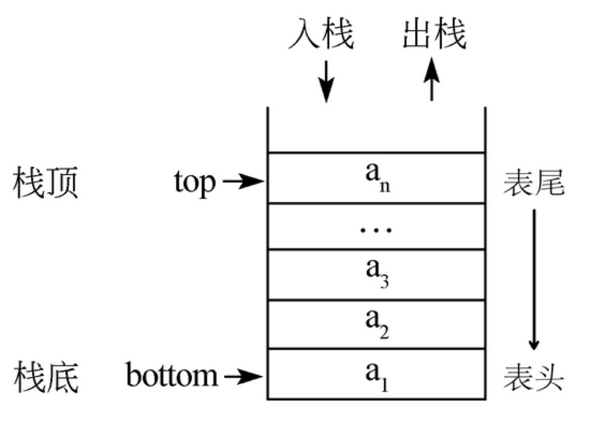
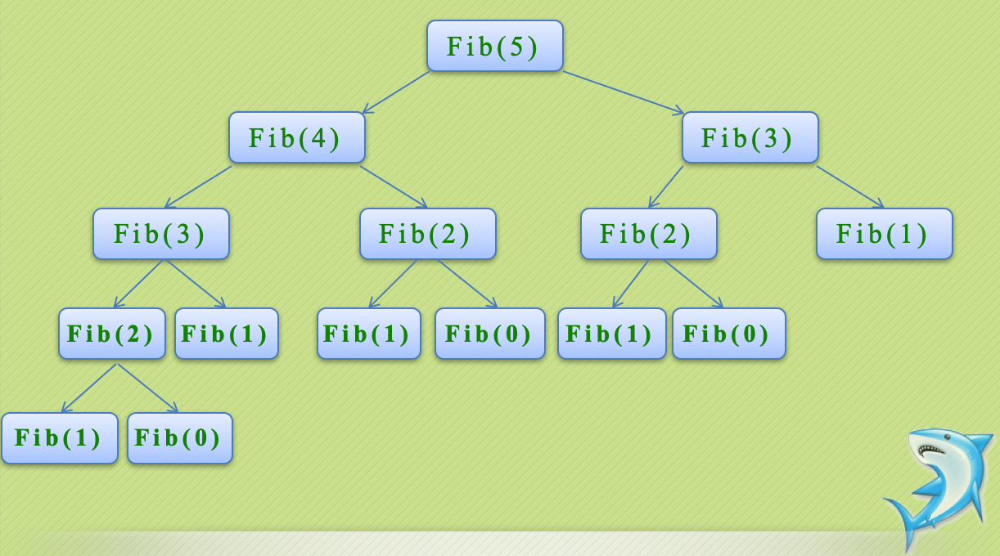
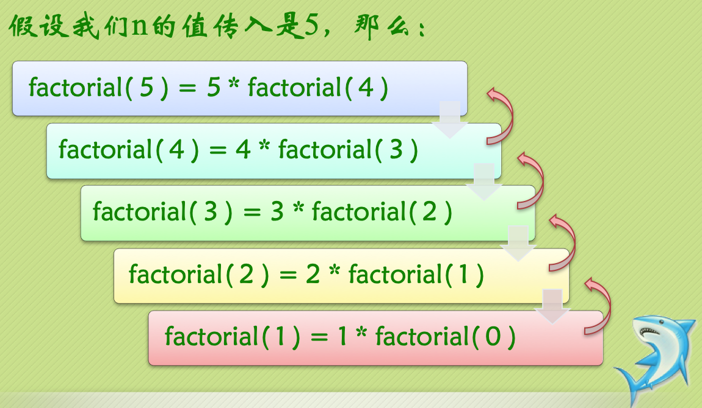
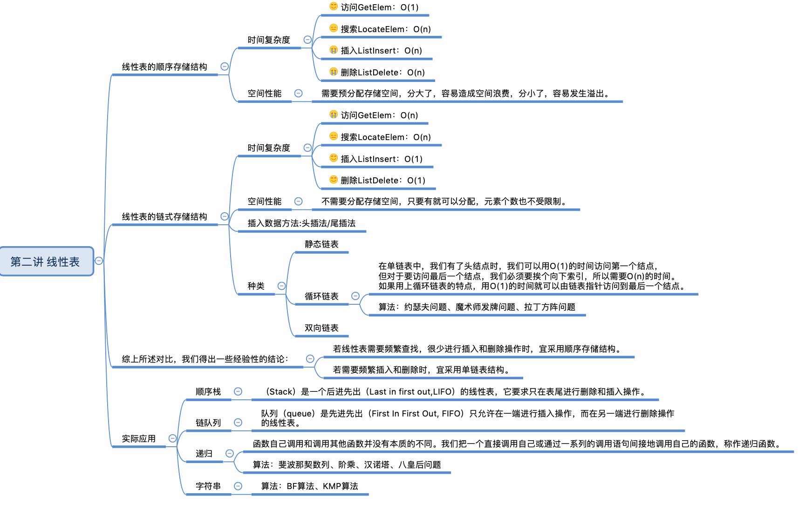

# 02-linear

## 第二讲 线性表

### 5.静态链表
游标实现法：

插入：


### 6.循环链表


#### 6.1 约瑟夫问题(continue)

据说著名犹太历史学家 Josephus有过以下的故事：在罗马人占领乔塔帕特后，39个犹太人与Josephus及他的朋友躲到一个洞中，39个犹太人决定宁愿死也不要被敌人抓到，于是决定了一个自杀方式，41个人排成一个圆圈，由第1个人开始报数，每报数到第3人该人就必须自杀，然后再由下一个重新报数，直到所有人都自杀身亡为止。

然而Josephus和他的朋友并不想遵从，Josephus要他的朋友先假装遵从，他将朋友与自己安排在第16个与第31个位置，于是逃过了这场死亡游戏。

#### 6.2 循环链表的特点

在单链表中，我们有了头结点时，我们可以用O(1)的时间访问第一个结点，但对于要访问最后一个结点，我们必须要挨个向下索引，所以需要O(n)的时间。

大家猜的没错，如果用上今天我们学习到的循环链表的特点，用O(1)的时间就可以由链表指针访问到最后一个结点。

#### 6.3 魔术师发牌问题(continue)

问题描述：魔术师利用一副牌中的13张黑牌，预先将他们排好后叠放在一起，牌面朝下。对观众说：“我不看牌，只数数就可以猜到每张牌是什么，我大声数数，你们听，不信？现场演示。”魔术师将最上面的那张牌数为1，把他翻过来正好是黑桃A，将黑桃A放在桌子上，第二次数1,2，将第一张牌放在这些牌的下面，将第二张牌翻过来，正好是黑桃2，也将它放在桌子上这样依次进行将13张牌全部翻出，准确无误。

问题：牌的开始顺序是如何安排的？

#### 6.4 拉丁方阵问题(continue)

拉丁方阵是一种n×n的方阵，方阵中恰有n种不同的元素，每种元素恰有n个，并且每种元素在一行和一列中 恰好出现一次。著名数学家和物理学家欧拉使用拉丁字母来作为拉丁方阵里元素的符号，拉丁方阵因此而得名。

### 7.双向链表

#### 7.1 双向链表结点结构(continue)
```cfml
typedef struct DualNode
{
ElemType data;
struct DualNode *prior;  //前驱结点
struct DualNode *next;   //后继结点
} DualNode, *DuLinkList;
```



### 8.顺序栈

栈（Stack）是一个后进先出（Last in first out,LIFO）的线性表，它要求只在表尾进行删除和插入操作。

注：对于栈来说，这个表尾称为栈的栈顶（top），相应的表头称为栈底（bottom）。

栈的插入操作（Push），叫做进栈，也称为压栈，入栈。类似子弹放入弹夹的动作。
栈的删除操作（Pop），叫做出栈，也称为弹栈。如同弹夹中的子弹出夹。


```cfml
typedef struct
{
ElemType *base;
ElemType *top;
int stackSize;
}sqStack;
这里定义了一个顺序存储的栈，它包含了三个元素：
base,top,stackSize。
其中base是指向栈底的指针变量，
top是指向栈顶的指针变量，
stackSize指示栈的当前可使用的最大容量。
```

#### 8.1逆波兰表达式(continue)
一种不需要括号的后缀表达式，我们通常把它称为逆波兰表达式(RPN) 
对于(1-2)*(4+5)，如果用逆波兰表示法，应该是这样：1 2 – 4 5 + * 

#### 8.2中缀表达式转换为后缀表达式(continue)


### 9.链队列
队列（queue）是只允许在一端进行插入操作，而在另一端进行删除操作的线性表。

与栈相反，队列是一种先进先出（First In First Out, FIFO）的线性表。


### 10.递归
在高级语言中，函数自己调用和调用其他函数并没有本质的不同。我们把一个直接调用自己或通过一系列的调用语句间接地调用自己的函数，称作递归函数。

迭代和递归的区别是：迭代使用的是循环结构，递归使用的是选择结构。

使用递归能使程序的结构更清晰、更简洁、更容易让人理解，从而减少读懂代码的时间。

但大量的递归调用会建立函数的副本，会消耗大量的时间和内存，而迭代则不需要此种付出。

递归函数分为调用和回退阶段，递归的回退顺序是它调用顺序的逆序。

#### 10.1 斐波那契数列的递归实现

```
         0，当n=0
F(n) =   1，当n=1
         F(n-1)+F(n-2)，当n>1
         
private static int fib(int n){
    if(n<0){
        throw new IllegalArgumentException();
    }else if(n<2){
        return n;
    }else{
        return fib(n-1)+fib(n-2);
    }
}
```

#### 10.2 阶乘

```
n的值传入是5，那么：
factorial(5) = 5 * factorial(4);
factorial(4) = 4 * factorial(3);
factorial(3) = 3 * factorial(2);
factorial(2) = 2 * factorial(1);
factorial(1) = 1 * factorial(0);

private static int factorial(int n) {
    if (n < 0) {
        throw new IllegalArgumentException();
    } else if (n == 0) {
        return 1;
    } else {
        return n * factorial(n - 1);
    }
}
```

#### 10.3 汉诺塔
```
/**
 * // 将 n 个盘子从 x 借助 y 移动到 z
 *
 * @param n
 * @param x
 * @param y
 * @param z
 */
private static void move(int n, Character x, Character y, Character z) {
    if (n == 1) {
        System.out.println(x + ">" + z);
    } else {
        // 将 n-1 个盘子从 x 借助 z 移到 y 上
        move(n - 1, x, z, y);
        // 将 第 n 个盘子从 x 移到 z 上
        System.out.println(x + ">" + z);
        // 将 n-1 个盘子从 y 借助 x 移到 z 上
        move(n - 1, y, x, z);
    }
}
```
[视频形象展示环节：汉诺塔游戏](src/main/resources/swf/链表/汉诺塔游戏.swf)


#### 10.4 八皇后问题(continue)

### 11 字符串

定义：串（String）是由零个或多个字符组成的有限序列，又名叫字符串。

一般记为 s =“a1a2a3......an”（n>=0）

串可以是空串，即没有字符，直接由 ””表示（注意里边没有空格哦~），或者可以用希腊字母Φ来表示（读fai，四声）。

#### 11.1 BF算法（Brute Force）(continue)

BF算法属于朴素的模式匹配算法，它的核心思想是：

有两个字符串S和T，长度为N和M。首先S[1]和T[1]比较，若相等，则再比较S[2]和T[2]，一直到T[M]为止；若S[1]和T[1]不等，则T向右移动一个字符的位置，再依次进行比较。

该算法最坏情况下要进行M*(N-M+1)次比较，时间复杂度为O(M*N)。

#### 11.2 KMP算法
问题由模式串决定，不是由目标决定！

附思维导图：


漫画：
### 漫画：如何用栈实现队列？
https://mp.weixin.qq.com/s/IiOUgS5jZ6pgVqUAJHwNKg

没啥用！！！


