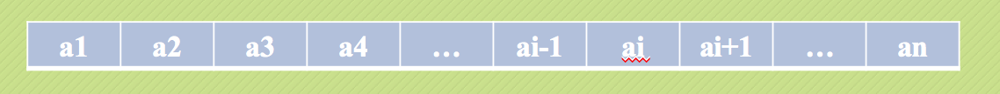
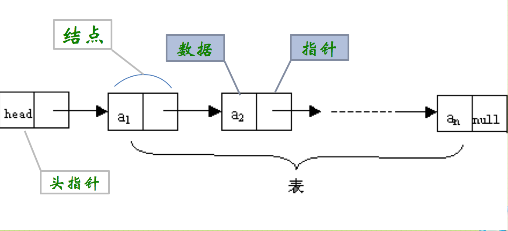
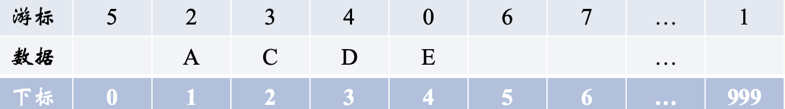
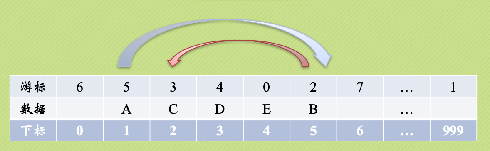

# 02-linear

## 第二讲 线性表
[返回主目录](../README.md)

### 1.线性表的定义
线性表（List）：由零个或多个数据元素组成的有限序列。

这里需要强调几个关键的地方：

* 首先它是一个序列，也就是说元素之间是有个先来后到的，像刚才的小蝌蚪就没有顺序。
* 若元素存在多个，则第一个元素无前驱，而最后一个元素无后继，其他元素都有且只有一个前驱和后继。

#### 1.1 抽象数据类型(Abstract Data Type，ADT）
标准格式：
```java
ADT 抽象数据类型名 //类
Data //成员变量
    数据元素之间逻辑关系的定义
Operation //成员方法
    操作
endADT
```

#### 1.2线性表的抽象数据类型
```java
ADT 线性表（List）
Data
    线性表的数据对象集合为{a1,a2,…,an}，每个元素的类型均为DataType。其中，除第一个元素a1外，每一个元素有且只有一个直接前驱元素，除了最后一个元素an外，每一个元素有且只有一个直接后继元素。数据元素之间的关系是一对一的关系。
Operation
    InitList(*L): 初始化操作，建立一个空的线性表L。
    ListEmpty(L): 判断线性表是否为空表，若线性表为空，返回true，否则返回false。
    ClearList(*L): 将线性表清空。
    GetElem(L,i,*e): 将线性表L中的第i个位置元素值返回给e。
    LocateElem(L,e): 在线性表L中查找与给定值e相等的元素，如果查找成功，返回该元素在表中序号表示成功；否则，返回0表示失败。
    ListInsert(*L,i,e): 在线性表L中第i个位置插入新元素e。
    ListDelete(*L,i,*e): 删除线性表L中第i个位置元素，并用e返回其值。
    ListLength(L): 返回线性表L的元素个数。
endADT
```

### 2.线性表的顺序存储结构
线性表的顺序存储结构，指的是用一段地址连续的存储单元依次存储线性表的数据元素。
线性表（a1,a2,…,an）的顺序存储如下：

#### 2.1线性表的顺序存储结构时间复杂度
* 访问GetElem：O(1)
* 搜索LocateElem：O(n)
* 插入ListInsert：O(n)
* 删除ListDelete：O(n)
```
插入和删除的时间复杂度。
最好的情况：插入和删除操作刚好要求在最后一个位置操作，因为不需要移动任何元素，所以此时的时间复杂度为O(1)。
最坏的情况：如果要插入和删除的位置是第一个元素，那就意味着要移动所有的元素向后或者向前，所以这个时间复杂度为O(n)。
至于平均情况，就取中间值O((n-1)/2)。
按照前边游戏秘籍指导，平均情况复杂度简化后还是O(n)。
```

#### 2.2 线性表顺序存储结构的优缺点
```
优点：
无须为表示表中元素之间的逻辑关系而增加额外的存储空间。
可以快速地存取表中任意位置的元素。
缺点：
插入和删除操作需要移动大量元素。
当线性表长度变化较大时，难以确定存储空间的容量。
容易造成存储空间的“碎片”。
```

#### 3.线性表的链式存储结构
线性表链式存储结构定义:
```
我们把存储数据元素信息的域称为数据域，把存储直接后继位置的域称为指针域。指针域中存储的信息称为指针或链。这两部分信息组成数据元素称为存储映像，称为结点(Node)。
n个结点链接成一个链表，即为线性表(a1, a2, a3, …, an)的链式存储结构。
因为此链表的每个结点中只包含一个指针域，所以叫做单链表。
```

#### 3.1线性表的顺序存储结构时间复杂度
* 访问GetElem：O(n)
* 搜索LocateElem：O(n)
* 插入ListInsert：O(1)
* 删除ListDelete：O(1)

#### 3.2头插法，尾插法


### 4.单链表结构与顺序存储结构优缺点
```
我们分别从存储分配方式、时间性能、空间性能三方面来做对比。
存储分配方式：
顺序存储结构用一段连续的存储单元依次存储线性表的数据元素。
单链表采用链式存储结构，用一组任意的存储单元存放线性表的元素。

1）时间性能：

查找
顺序存储结构O(1)
单链表O(n)

插入和删除
顺序存储结构需要平均移动表长一半的元素，时间为O(n)
单链表在计算出某位置的指针后，插入和删除时间仅为O(1)

2）空间性能：
顺序存储结构需要预分配存储空间，分大了，容易造成空间浪费，分小了，容易发生溢出。
单链表不需要分配存储空间，只要有就可以分配，元素个数也不受限制。

3) 综上所述对比，我们得出一些经验性的结论：
若线性表需要频繁查找，很少进行插入和删除操作时，宜采用顺序存储结构。
若需要频繁插入和删除时，宜采用单链表结构。

```

### 5.静态链表
游标实现法：

插入：


### 6.循环链表


### 7.约瑟夫问题

据说著名犹太历史学家 Josephus有过以下的故事：在罗马人占领乔塔帕特后，39个犹太人与Josephus及他的朋友躲到一个洞中，39个犹太人决定宁愿死也不要被敌人抓到，于是决定了一个自杀方式，41个人排成一个圆圈，由第1个人开始报数，每报数到第3人该人就必须自杀，然后再由下一个重新报数，直到所有人都自杀身亡为止。

然而Josephus和他的朋友并不想遵从，Josephus要他的朋友先假装遵从，他将朋友与自己安排在第16个与第31个位置，于是逃过了这场死亡游戏。

