# 03-tree

## 第三讲 树
[返回主目录](../README.md)

### 1.树的定义
树(Tree)是n(n>=0)个结点的有限集。当n=0时成为空树，在任意一棵非空树中：

有且仅有一个特定的称为根(Root)的结点；

当n>1时，其余结点可分为m(m>0)个互不相交的有限集T1、T2、...、Tm，其中每一个集合本身又是一棵树，并且称为根的子树(SubTree)。
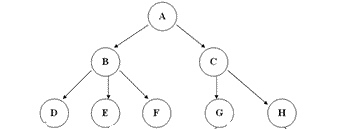

#### 1.1 结点分类
每一个圈圈我们就称为树的一个结点。结点拥有的子树数称为结点的度-(Degree)，树的度取树内各结点的度的最大值。

度为0的结点称为叶结点(Leaf)或终端结点；

度不为0的结点称为分支结点或非终端结点，除根结点外，分支结点也称为内部结点。
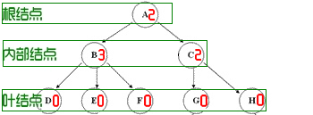

#### 1.2 结点间的关系
结点的子树的根称为结点的孩子(Child)，相应的，该结点称为孩子的双亲(Parent)，同一双亲的孩子之间互称为兄弟(Sibling)。

结点的祖先是从根到该结点所经分支上的所有结点。

#### 1.3 结点的层次
结点的层次(Level)从根开始定一起，根为第一层，根的孩子为第二层。

其双亲在同一层的结点互为堂兄弟。

树中结点的最大层次称为树的深度(Depth)或高度。
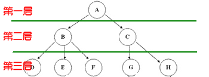

### 2.树的存储结构

#### 2.1 双亲表示法
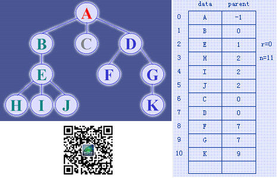

#### 2.2 孩子表示法
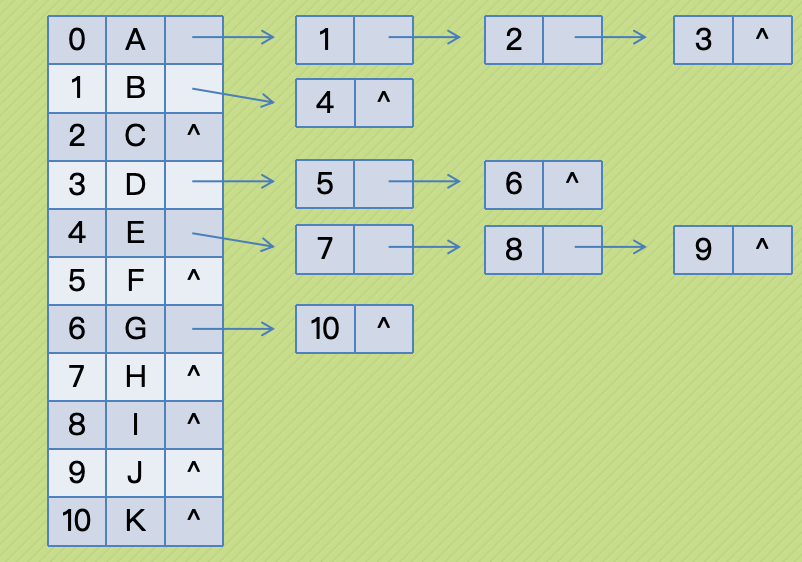

#### 2.3 双亲孩子表示法
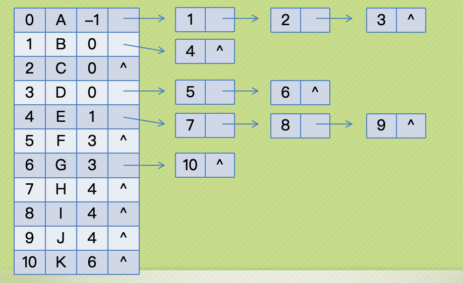

### 3.二叉树

#### 3.1 二叉树的定义
二叉树（Binary Tree）是n（n>=0）个结点的有限集合，该集合或者为空集（空二叉树），或者由一个根结点和两棵互不相交的、分别称为根结点的左子树和右子树的二叉树组成。

#### 3.2 二叉树的五种基本形态

空二叉树


只有一个根结点


根结点只有左子树

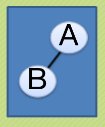

根结点只有右子树

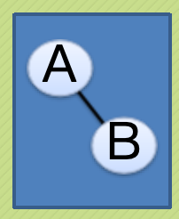

根结点既有左子树又有右子树

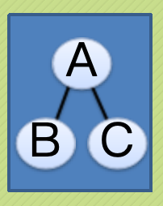

#### 3.3 二叉链表
```cfml
typedef struct BiTNode
{
ElemType data;
struct BiTNode *lchild, *rchild;
} BiTNode, *BiTree;
```

#### 3.4 二叉树的遍历
略

### 4 线索二叉树
lchild|ltag|data|rtag|rchild
---|---|---|---|---
    ltag为0时指向该结点的左孩子，为1时指向该结点的前驱。
    rtag为0时指向该结点的右孩子，为1时指向该结点的后继。

### 5 树、森林和二叉树的转换
### 5.1 普通树转换为二叉树
    步骤如下：
    加线，在所有兄弟结点之间加一条连线。
    去线，对树中每个结点，只保留它与第一孩子结点的连线，删除它与其他孩子结点之间的连线。
    层次调整，以树的根结点为轴心，将整棵树顺时针旋转一定的角度，使之结构层次分明。
### 5.2 森林转换为二叉树
    步骤如下：
    把每棵树转换为二叉树。
    第一棵二叉树不动，从第二棵二叉树开始，依次把后一棵二叉树的根结点作为前一棵二叉树的根结点的右孩子，用线连接起来。

### 5.3 树与森林的遍历
    我们的惊人发现：树、森林的前根（序）遍历和二叉树的前序遍历结果相同，树、森林的后根（序）遍历和二叉树的中序遍历结果相同！


### 6 赫夫曼树
    结点的路径长度：
    从根结点到该结点的路径上的连接数。
    树的路径长度：
    树中每个叶子结点的路径长度之和。
    结点带权路径长度：
    结点的路径长度与结点权值的乘积。
    树的带权路径长度：
    WPL(Weighted Path Length)是树中所有叶子结点的带权路径长度之和。

#### 6.1 赫夫曼编码
    上一节课我们已经谈了赫夫曼树的基本原理和构造方式，而赫夫曼编码可以很有效地压缩数据（通常可以节省20%~90%的空间，具体压缩率依赖于数据的特性）。
    名词解释：定长编码，变长编码，前缀码
    定长编码：像ASCII编码
    变长编码：单个编码的长度不一致，可以根据整体出现频率来调节
    前缀码：所谓的前缀码，就是没有任何码字是其他码字的前缀
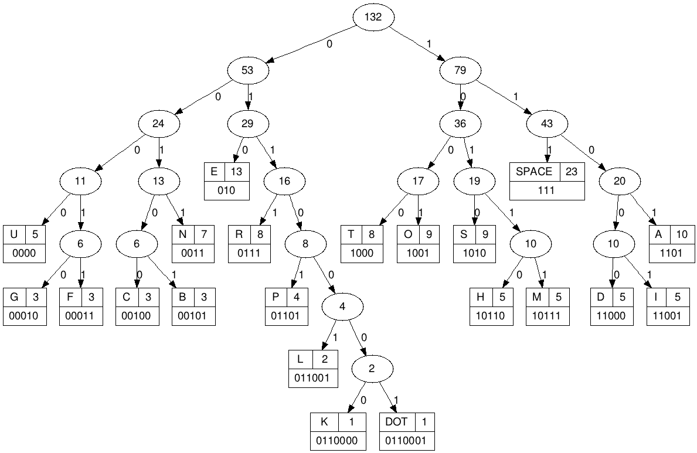

附思维导图：
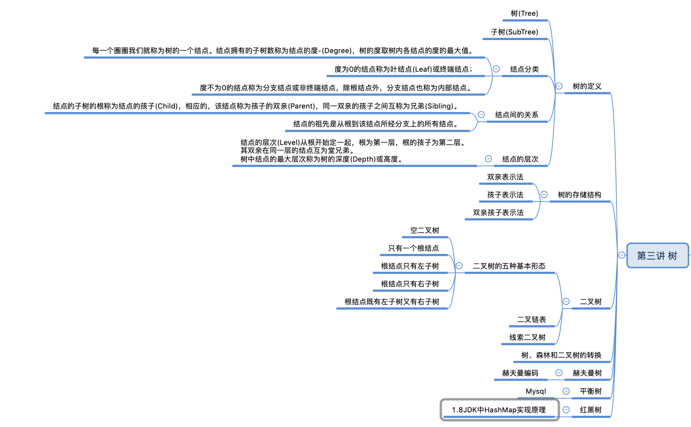
