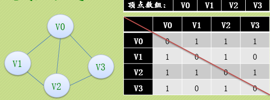
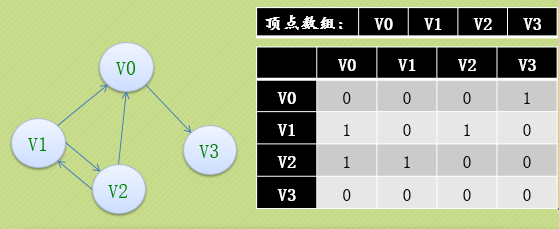
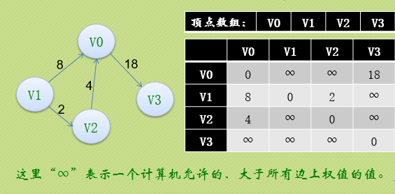

# 04-graph

## 第四讲 图
[返回主目录](../README.md)

### 1.图的定义
图（Graph）是由顶点的有穷非空集合和顶点之间边的集合组成，通常表示为：G(V,E)，其中，G表示一个图，V是图G中顶点的集合，E是图G中边的集合。

对于图的定义，我们需要明确几个注意的地方：

    线性表中我们把数据元素叫元素，树中叫结点，在图中数据元素我们则称之为顶点(Vertex)。
    线性表可以没有数据元素，称为空表，树中可以没有结点，叫做空树，而图结构在咱国内大部分的教材中强调顶点集合V要有穷非空。
    线性表中，相邻的数据元素之间具有线性关系，树结构中，相邻两层的结点具有层次关系，而图结构中，任意两个顶点之间都可能有关系，顶点之间的逻辑关系用边来表示，边集可以是空的。

### 1.1 图的各种奇葩定义
    无向边
    有向边
    简单图
    无向完全图
    有向完全图
    稀疏图和稠密图：这里的稀疏和稠密是模糊的概念，都是相对而言的，通常认为边或弧数小于n*logn（n是顶点的个数）的图称为稀疏图，反之称为稠密图。
    有些图的边或弧带有与它相关的数字，这种与图的边或弧相关的数叫做权(Weight)，带权的图通常称为网(Network)。
    子图
### 1.2 图的顶点与边之间的关系
    略
### 1.3 连通图
    略

### 2.图的存储结构
    图的存储结构相比较线性表与树来说就复杂很多。
    我们回顾下，对于线性表来说，是一对一的关系，所以用数组或者链表均可简单存放。树结构是一对多的关系，所以我们要将数组和链表的特性结合在一起才能更好的存放。
    因为任意两个顶点之间都可能存在联系，因此无法以数据元素在内存中的物理位置来表示元素之间的关系（内存物理位置是线性的，图的元素关系是平面的）。

### 2.1 邻接矩阵（无向图）
    考虑到图是由顶点和边或弧两部分组成，合在一起比较困难，那就很自然地考虑到分为两个结构来分别存储。
    顶点因为不区分大小、主次，所以用一个一维数组来存储是狠不错的选择。
    而边或弧由于是顶点与顶点之间的关系，一维数组肯定就搞不定了，那我们不妨考虑用一个二维数组来存储。

    我们可以设置两个数组，顶点数组为vertex[4]={V0,V1,V2,V3}，边数组arc[4][4]为对称矩阵(0表示不存在顶点间的边，1表示顶点间存在边)。
    对称矩阵：所谓对称矩阵就是n阶矩阵的元满足a[i][j]=a[j][i](0<=i,j<=n)。即从矩阵的左上角到右下角的主对角线为轴，右上角的元与左下角相对应的元全都是相等的。

### 2.2 邻接矩阵（有向图）

### 2.3 邻接矩阵（网）

