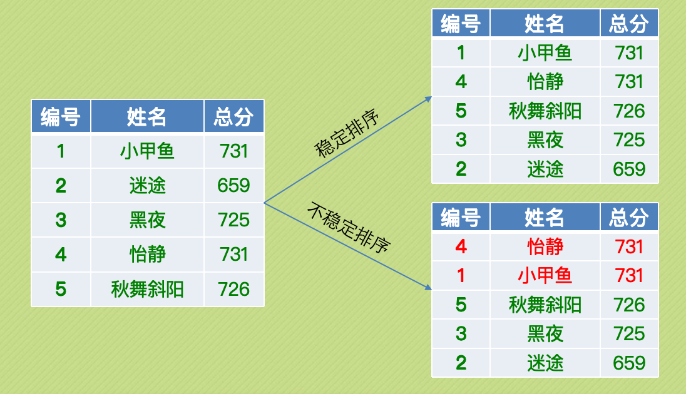

# 05-algorithm

## 第五讲 算法
[返回主目录](../README.md)

### 1.排序算法概论

文绉绉的概念：
假设含有n个记录的序列为{r1,r2,…,rn}，其相应的关键字分别为{k1,k2,…,kn}，
需确定1,2,…,n的一种排列p1,p2,…pn,使其相应的关键字满足kp1<=kp2<=…<=kpn非递减（或非递增）关系，
即使得序列成为一个按关键字有序的序列{rp1,rp2,…rpn}，这样的操作就称为排序。

在排序问题中，通常将数据元素称为记录。
显然我们输入的是一个记录集合，排序后输出的也是一个记录集合。
所以我们可以将排序看成是线性表的一种操作。

排序的依据是关键字之间的大小关系，那么对同一记录集合，针对不同的关键字进行排序，可以得到不同序列。

#### 1.1 排序的稳定性
假设ki=kj(1<=i<=n,1<=j<=n,i!=j)，且在排序前的序列中ri领先于rj(即i<j)。

如果排序后ri仍领先于rj，则称所用的排序方法是稳定的；

反之，若可能使得排序后的序列中rj领先ri，则称所用的排序方法是不稳定的。

#### 1.2 影响排序算法性能的几个要素
    时间性能
    辅助空间
    算法的复杂性

### 2.排序算法
#### 2.1 冒泡排序
    屌丝版
    正宗版
    优化版
算法的时间复杂度：O(n^2)，排序效率最低的。

#### 2.2 直接选择排序
算法的时间复杂度：O(n^2)，但移动的次数减少了。

#### 2.3 插入排序

#### 2.4 希尔排序

