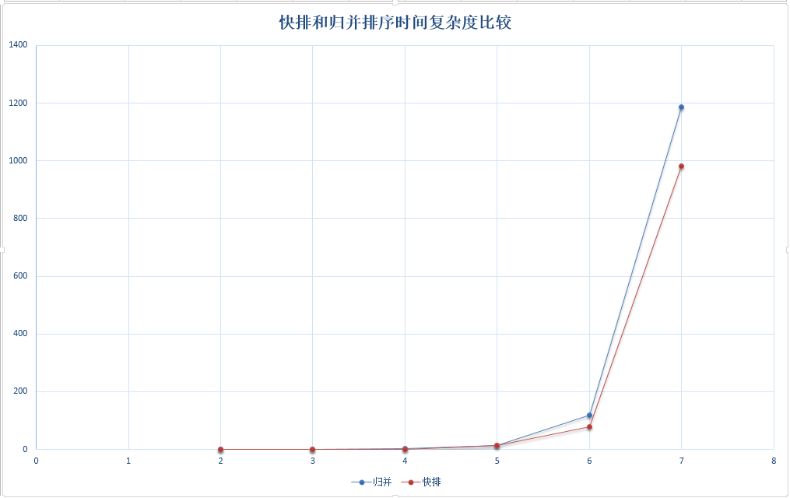
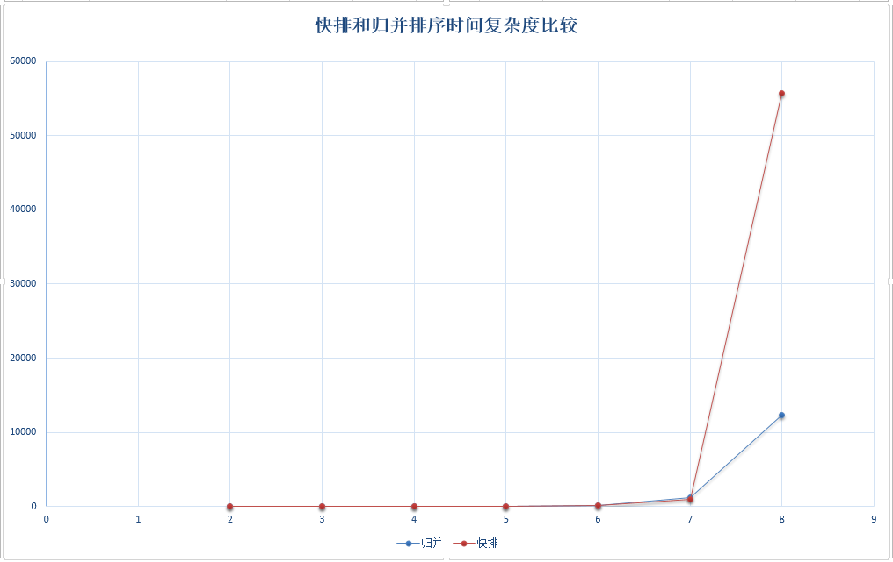

# 05-algorithm

## 第五讲 算法
[返回主目录](../README.md)

### 1.排序算法概论

文绉绉的概念：
假设含有n个记录的序列为{r1,r2,…,rn}，其相应的关键字分别为{k1,k2,…,kn}，
需确定1,2,…,n的一种排列p1,p2,…pn,使其相应的关键字满足kp1<=kp2<=…<=kpn非递减（或非递增）关系，
即使得序列成为一个按关键字有序的序列{rp1,rp2,…rpn}，这样的操作就称为排序。

在排序问题中，通常将数据元素称为记录。
显然我们输入的是一个记录集合，排序后输出的也是一个记录集合。
所以我们可以将排序看成是线性表的一种操作。

排序的依据是关键字之间的大小关系，那么对同一记录集合，针对不同的关键字进行排序，可以得到不同序列。

#### 1.1 排序的稳定性
假设ki=kj(1<=i<=n,1<=j<=n,i!=j)，且在排序前的序列中ri领先于rj(即i<j)。

如果排序后ri仍领先于rj，则称所用的排序方法是稳定的；

反之，若可能使得排序后的序列中rj领先ri，则称所用的排序方法是不稳定的。

#### 1.2 影响排序算法性能的几个要素
    时间性能
    辅助空间
    算法的复杂性

### 2.排序算法
#### 2.1 冒泡排序
    屌丝版
    正宗版
    优化版
算法的时间复杂度：O(n^2)，排序效率最低的。

漫画：什么是冒泡排序？
URL:  https://mp.weixin.qq.com/s/wO11PDZSM5pQ0DfbQjKRQA
了解，没啥用，算法时间复杂度：O(n^2)

漫画：什么是鸡尾酒排序？（修订版）
URL:  https://mp.weixin.qq.com/s/CoVZrvis6BnxBQgQrdc5kA
了解，没啥用，算法时间复杂度：O(n^2)

#### 2.2 直接选择排序
算法的时间复杂度：O(n^2)，但移动的次数减少了。

#### 2.3 插入排序

#### 2.4 希尔排序

#### 2.5 堆排序

#### 2.6 归并排序
    递归实现
    迭代实现

### 3.效率比较

 Java提供了Collections.sort()来对数组进行排序，其内部采取的是归并排序；
 
 此外还提供了Arrays.sort()采用了2种排序算法 – 基本类型数据使用快速排序法，对象数组使用归并排序。

1）在同一台计算机上，修改size的值，得到两个算法在不同数组长度下的执行时间：

数组长度	| 快速排序（运行时间/毫秒）| 归并排序（运行时间/毫秒）
---|---|---
100 | 0 | 0
1000 | 1 | 1
10000 | 1 | 3
100000 | 14 | 14
1000000 | 79 | 120
10000000 | 982 | 1186
100000000 | 55733 | 12328

2）我们知道快排和归并的理论上的时间复杂性如下表：

算法 | 最坏时间复杂性 | 平均时间复杂性
---|---|---
快速排序 | n^2 | n*log(n)
归并排序 | n*log(n) | n*log(n)

1.在数组长度小于一千万的时候，如下图，快速排序的速度要略微快于归并排序，可能是因为归并需要额外的数组开销（比如声明临时local数组用来储存排序结果），这些操作让归并算法在小规模数据的并不占优势。

2.但是，当数据量达到亿级时，归并的速度开始超过快速排序了，如下图，因为归并排序比快排要稳定，所以在数据量大的时候，快排容易达到O(n^2)的时间复杂度，当然这里是指未改进的快排算法。

