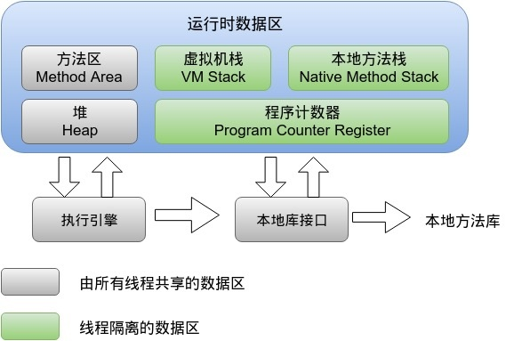

# 06-vm

## 第六讲 深入Java虚拟机
[返回主目录](../README.md)

### 1.走进Java
略(捞干的)

 
### 2.Java内存区域和内存溢出异常

#### 2.1 运行时数据区域 

区域 | 线程共享还是私有 | Error
---|---|---
程序计数器(Program Counter Register) | 线程私有 | 唯一一个没有规定OOMError区域
虚拟机栈(Virtual Machine Stacks) | 线程私有 | OOMError/SOFError
本地方法栈(Native Method Stacks) | 线程私有 | OOMError/SOFError
堆(Heap) | 线程共享 | OOMError
方法区(Method Area，非堆Non-Heap) | 线程共享 | OOMError
 
##### 2.1.1 程序计数器 
   是当前线程所执行的字节码的行号指示器。

##### 2.1.2 Java虚拟机栈
   为字节码方法服务。
 
##### 2.1.3 本地方法栈
   为Native方法服务  

##### 2.1.4 Java堆
   新生代和老年代：-Xms20m -Xmx20m -Xmn10m。
   新生代：Eden空间、From Survivor空间、To Survivor空间，-XX:SurvivorRadio=8。

##### 2.1.5 方法区
    方法区(JDK1.7)
    
    方法区主要用于存放已经被虚拟机加载的类信息，如常量，静态变量。 这块区域也被称为永久代。
    
    可利用参数 -XX:PermSize -XX:MaxPermSize 控制初始化方法区和最大方法区大小。
    
    元数据区(JDK1.8)
    
    在 JDK1.8 中已经移除了方法区（永久代），并使用了一个元数据区域进行代替（Metaspace）。
    
    默认情况下元数据区域会根据使用情况动态调整，避免了在 1.7 中由于加载类过多从而出现 java.lang.OutOfMemoryError: PermGen。
    
    但也不能无限扩展，因此可以使用 -XX:MaxMetaspaceSize来控制最大内存。

   储存已被虚拟机加载的类信息、常量、静态变量、及时编译器编译后的代码。
   运行时常量池(Runtime Constant Pool) 是方法区的一部分，String的intern()方法。
   
   JDK8-废弃永久代（PermGen）迎来元空间（Metaspace）
   https://www.cnblogs.com/dennyzhangdd/p/6770188.html

##### 2.1.6 直接内存
   直接内存(Direct Memory)并不是Java虚拟机运行数据区域的一部分。

#### 2.2 对象访问
    指针。
    句柄。   

#### 2.3 实战：OutOfMemoryError异常
    Java堆溢出
    虚拟机栈溢出和本地方法栈溢出
    运行时常量池溢出
    方法区溢出
    本机直接内存溢出

### 3.垃圾收集器和内存分配策略

    引用计数算法(无法解决循环引用)
    可达行分析算法(Java使用，GC Roots)

#### 3.1 垃圾收集算法
    标记-清除(Mark-Sweep)算法
    复制(Copying)算法
    标记-整理(Mark-Compact)算法
    分代收集算法

#### 3.2 垃圾收集器
垃圾收集器 | 模式 | 分代回收 | 线程数 | 垃圾收集算法
---|---|---|---|---
Serial收集器 | Client模式下 | 新生代 | 单线程 | 复制算法
ParNew收集器 | Server模式下 | 新生代 | 多线程 | 复制算法
Parallel Scavenge收集器（常用） | Server模式下 | 新生代 | 多线程 | 复制算法
Serial Old收集器 | Client模式下 | 老年代 | 单线程 | 标记-整理算法
Parallel Old收集器（常用） | Server模式下 | 老年代 | 多线程 |  标记-整理算法
CMS（Concurrent Mark Sweep）| B/S系统的Server端上 | 老年代 | 多线程 | 标记-清除算法
G1收集器（Garbage First）| Server端上 | 老年代 | 多线程 | 标记-整理算法

    

#### 3.3 内存分配与回收策略
    对象优先在Eden分配
    大对象直接进入老年代
    长期存活的对象将进入老年代
    动态对象年龄判定
    空间分配担保
    
    
    
    
    

### 4.虚拟机性能监控与故障处理工具
#### 4.1 JDK命令行工具

##### 4.1.1 jps:虚拟机进程状况工具
    jps（JVM Process Status Tool）
    虚拟机进程状况工具，显示虚拟机执行主类（Main Class），以及这些进程的本地虚拟机唯一ID（LVMID，Local Virtual Machine Identifier）
    jps -mlvV
    
##### 4.1.2 jstat:虚拟机统计信息监视工具
    jstat（JVM statistics Monitoring Tool） 
    jstat -gcutil PID 1000

##### 4.1.3 jinfo:java配置信息工具
    jinfo(Configuration Info for java)
    jinfo -flags PID

##### 4.1.4 jmap:java内存映像工具
    jmap（Memory Map for java）用于生成堆转储快照（headdump或dump文件）
    jmap -heap PID
    jmap -histo PID| head -10
##### 4.1.5 jhat:虚拟机堆转储快照快照分析工具
    jhat（JVM Heap Analysis Tool）：不建议
    Eclipse Memory Analyzer
    IBM HeapAnalyzer    

##### 4.1.6 jstack:Java堆栈跟踪工具
    jstack(Stack Trace for Java)用于生成当前时刻的线程快照（threaddump或javacore文件）。
    jstack PID
    jstack -m PID      
      
#### 4.2 JDK的可视化工具
    JConsole
    VisualVM
    btrace可以用阿里的arthas代替
    
    
    
    
    
### 5.jvm调优
    -Xms1G == -XX:InitialHeapSize=1G
    -Xmx1G == -XX:MaxHeapSize=1G
    -Xss512k  == -XX:ThreadStackSize=512k 
#### 5.1 IDEA调优
    -XX:MetaspaceSize=1g
    -XX:MaxMetaspaceSize=1g

    -Xms2g
    -Xmx2g
    -XX:ReservedCodeCacheSize=1024m
    -XX:+UseCompressedOops
    
    #由CMS换成G1
    #-XX:+UseConcMarkSweepGC
    -XX:+UseG1GC
#### 5.2 Eclipse调优
    -XX:MetaspaceSize=1g
    -XX:MaxMetaspaceSize=1g
    
    -Xms2g
    -Xmx2g
    -XX:ReservedCodeCacheSize=1024m
    -XX:+UseCompressedOops
    

### 6.类文件结构
Class文件格式和字节码指令集是<B>平台(JAVA虚拟机规范)</B>和<B>语言(JAVA语言规范)</B>无关性的基石。
#### 6.1字段表集合
    B-基本类型byte
    C-基本类型char
    D-基本类型double
    F-基本类型float
    I-基本类型int
    J-基本类型long
    S-基本类型short
    Z-基本类型boolean
    V-特殊类型void
    L-对象类型,如Ljava/lang/Object
    [-数组类型,如java.lang.String[][],被记录为[[Ljava/lang/String;int[],被记录为[I         

### 7.虚拟机类加载机制

#### 7.1 类加载的过程

##### 7.1.1 加载
虚拟机需要完成以下3件事情：

    1）通过一个类的完全限定名来获取定义此类的二进制字节流。（ZIP包中读取（jar、war）、网络中获取、运行时计算生成（动态代理技术）、由其他文件生成（JSP）、从数据库中读取分发）
    2）将这个字节流所代表的静态存储结构转化为方法区的运行时数据结构。
    3）在内存中生成一个代表这类的java.lang.Class对象（比较特殊在方法区里面），作为方法区这个类的各种数据的访问入口。

数组类本身不通过类加载器创建，它是由Java虚拟机直接创建的。       
        
##### 7.1.2 验证
文件格式验证

原数据验证

字节码验证

符号引用验证

##### 7.1.3 准备
正式为类变量分配内存并设置类变量初始值的阶段，这些变量所使用的内存都将在方法区中进行分配。

类变量如果定义为：public static final int value = 123;在准备阶段虚拟机就会根据ConstantValue的设置将value赋值为123.

##### 7.1.4 解析
类和接口的解析

字段解析

类方法解析

接口方法解析

##### 7.1.5 初始化
真正开始执行类中定义的Java程序代码（或者说字节码）。

#### 7.2 类加载器
    
     
       
   
    